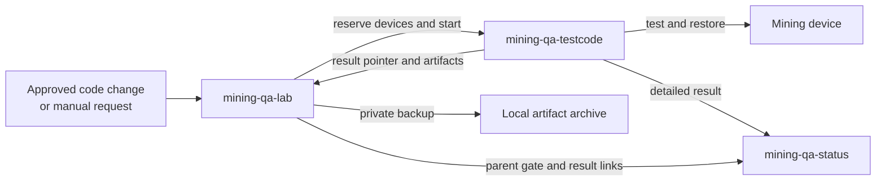

# mining-qa-lab

`mining-qa-lab` runs trusted hardware test gates in a private mining lab. It
selects an exact project revision, reserves the required devices, starts
`mining-qa-testcode`, keeps a local copy of test artifacts, and publishes the
overall gate result.

## How it fits together



The lab service:

- watches configured projects and accepts scheduled or manual requests;
- gives each active test exclusive access to its lab devices;
- can install an exact test runner revision and an approved firmware build;
- records runs, worker logs, and recovery state;
- keeps a private, verified copy of test artifacts;
- publishes the parent gate while testcode publishes each detailed result.

The status service never receives lab passwords, private device addresses, USB
paths, or commands that control hardware.

## Quick start

Python 3.11 or newer is required.

```bash
python3 -m venv .venv
. .venv/bin/activate
python3 -m pip install -e .
miner-orchestrator init-config orchestrator.local.yaml
miner-orchestrator --config orchestrator.local.yaml validate
miner-orchestrator --config orchestrator.local.yaml serve
```

Open <http://127.0.0.1:8765>. Keep `orchestrator.local.yaml` private and
untracked. The generated file is an example and must be changed for your lab.

## Run a gate from the UI

Open **Run gates** and choose:

1. the configured project;
2. the gate;
3. a source branch or exact 40-character commit;
4. one or more available device types.

If the commit is blank, the service resolves the latest configured `main`
branch, then `master` as a fallback. The run stores the exact commit before it
uses hardware.

The same page can queue an untrusted pull request only after an operator
approves its exact current commit.

## Results and local artifacts

The overview shows recent gates and their status. It also lets an authenticated
operator browse or download the private artifact copy stored by the lab.

Local storage is extra protection, not a replacement for publication.
`mining-qa-testcode` still publishes every detailed result to
`mining-qa-status`, and the lab still publishes the parent gate and child
links.

## Documentation

- [User guide](docs/USER_GUIDE.md): configure the lab, start the service, run
  gates, and view local artifacts.
- [Deployment guide](docs/ORCHESTRATOR_DEPLOYMENT.md): install, update, check,
  and roll back the systemd service.
- [Orchestration contract](contracts/orchestration-v1.md): versioned interface
  between the lab and testcode.
- [Specifications](specs/README.md): implementation behavior and project
  boundaries.
- [Agent instructions](AGENTS.md): repository rules for automated contributors.
