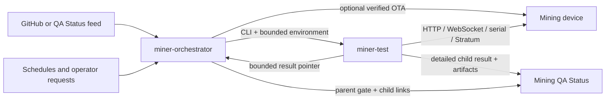

# miner-testcode — overview

## Purpose

`miner-testcode` provides repeatable, evidence-producing tests against real
Bitcoin mining devices and a local lab service that schedules those tests from
authorized repository or operator events.

The project makes hardware validation reviewable without hiding device-specific
behavior inside generic tests. It preserves exact test-code and firmware
provenance, restores mutable device state after tests, and publishes detailed
child results separately from aggregate gate status.

## Users and dependent systems

- **Firmware developers and reviewers** — need trustworthy evidence that an
  exact firmware revision behaves correctly on compatible hardware.
- **Lab operators** — configure private hosts, devices, setups, trust rules, and
  recovery procedures.
- **Mining devices** — expose HTTP, WebSocket, serial, and Stratum behavior that
  adapters normalize into portable contracts.
- **GitHub and repository automation** — provide branch, pull-request, build,
  and artifact provenance.
- **Mining QA Status** — stores detailed child results and parent gate records,
  serves private artifacts, and presents status to users.

## Main capabilities

### Detailed hardware test runner

- Capability-oriented device adapters and failure-safe lifecycle management.
- Bounded HTTP, WebSocket, serial, OTA, and Stratum interfaces.
- Public-pool observation and local Stratum V1 regression testing.
- Normalized state, telemetry, chart markers, artifacts, privacy, and exact
  source provenance.
- Local, GitHub Check, and Mining QA Status result publication.

### Durable lab orchestrator

- Revisioned YAML configuration and authenticated/local-network control plane.
- GitHub, QA Status feed, schedule, trusted PR, exact-SHA approval, and manual
  event intake.
- Deterministic gate planning, change filtering, setup matrices, supersession,
  SQLite WAL persistence, resource leases, retry, cancel, and recovery.
- Exact successful-build artifact resolution and board-verified OTA.
- Opt-in latest-branch testcode resolution, exact per-gate/host pinning, and
  isolated local or SSH worker installation.
- Local or SSH worker execution with bounded environment and child-result
  pointers.
- Parent gate publication and immutable links to child results.
- Exact-release systemd service deployment with idle cutover and retained rollback.

### Repository tooling

- Portable, validated project skills with conflict-safe linked installation.
- Agent and human deployment guidance that preserves authorization, privacy,
  state, and hardware-safety boundaries.

## Project boundary

### Test runner owns

- TOML loading, test and device selection, test discovery, and validation-case
  opt-in.
- One complete device lifecycle: identify, optionally upgrade, capture mutable
  baseline, test, restore, collect logs, close interfaces.
- Detailed test outcome, telemetry, artifacts, privacy pass, provenance, and
  child publication.
- Writing the bounded result pointer consumed by an orchestrator assignment.

### Lab orchestrator owns

- Trigger collection, authorization, event deduplication, gate planning, and
  configuration snapshotting.
- Lab inventory, setup compatibility, device resource leases, durable run and
  assignment state, and interrupted-run recovery.
- Optional verified firmware deployment before a gate's test modules.
- Resolving, pinning, and safely preparing the configured worker testcode when
  installation is enabled.
- Starting `miner-test`, collecting its result pointer, aggregating the gate,
  and publishing only parent status and child links.

### Owned elsewhere

- Firmware compilation and GitHub Actions workflow execution.
- Mining QA Status authentication, durable result presentation, GitHub App
  checks, PR summaries, storage, and webhook ingestion.
- Mining pool behavior and availability.
- Physical lab wiring, power control, network security, and device credentials.

## System context

## Cross-system runner contract

The orchestrator invokes `miner-test` with a runner profile, test pattern,
optional selected devices, and optional PR validation number. When managed
testcode is enabled it also selects one exact repository/SHA per gate and host,
installs it before execution, and requires the runner to independently verify
that source before hardware construction. It supplies:

- `MINER_TEST_ORCHESTRATION_METADATA`
- `MINER_TEST_EXTERNAL_RUN_ID`
- `MINER_TEST_RESULT_POINTER`
- `MINER_TEST_PR_NUMBER` when applicable
- `GITHUB_REPOSITORY`, `GITHUB_SHA`, and `GITHUB_REF_NAME`

The runner owns child publication and writes a bounded JSON result pointer with
overall success, status, run identity, local artifact root, and publisher
records. The orchestrator stores a returned Mining QA child ID/URL, links it to
the parent gate when available, and uses the assignment status in aggregate
gate policy. The orchestrator does not read child artifacts to reconstruct a
detailed result.

## Cross-cutting constraints

- **Compatibility:** Python 3.11 or newer; feature-specific device support is
  capability and adapter driven.
- **Reliability and recovery:** mutable device state is restored even after
  assertion/setup errors; SQLite WAL and immutable run snapshots survive
  service restarts; interrupted active assignments fail closed.
- **Security, privacy, and safety:** secrets remain environment-only; published
  evidence is sanitized; untrusted PR approval is exact-SHA; device writes and
  OTA have explicit preconditions and postconditions.
- **Performance and resources:** network and artifact sizes are bounded;
  structured telemetry is downsampled while complete local evidence remains.
- **Operations:** local coordinates stay in ignored files; detailed worker logs
  and result pointers remain available for diagnosis; live HIL is reported
  separately from unit or packaging checks.

## Developer orientation

- Working rules and verification commands: [AGENTS.md](../AGENTS.md)
- User and operator setup: [README.md](../README.md)
- Complete feature directory: [INDEX.md](INDEX.md)
- Outcome navigation: [STORY-MAP.md](STORY-MAP.md)
- Documentation maintenance: [MAINTENANCE.md](MAINTENANCE.md)
- Repository skill contract:
  [Repository skills](project-tooling/repository-skills/SPEC.md)
- Human service runbook:
  [ORCHESTRATOR_DEPLOYMENT.md](../docs/ORCHESTRATOR_DEPLOYMENT.md)

## Changelog

- 2026-08-10: Added exact-release service deployment and repository-owned agent
  skills as explicit project capabilities.
- 2026-08-10: Added opt-in latest-testcode resolution with per-gate/host SHA
  pinning, isolated worker installation, and runner-side provenance checks.
- 2026-08-10: Established the test-runner/lab-orchestrator ownership boundary
  and cross-system child-result contract.
