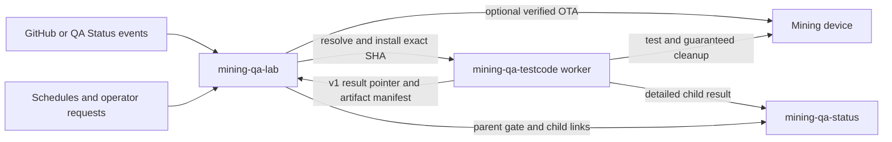

# mining-qa-lab — overview

## Purpose

`mining-qa-lab` converts authorized source changes and operator requests into
durable, reviewable hardware qualification gates. It protects private lab
coordinates and shared devices while preserving exact source, firmware, runner,
and result provenance.

## Mining QA project relationship

| Project | Owns | Does not own |
|---|---|---|
| [`mining-qa-lab`](https://github.com/johnny9/mining-qa-lab) | event trust, gates, lab inventory, leases, firmware deployment, runner installation/execution, private artifact redundancy, parent results | test cases, device cleanup, detailed evidence publication |
| [`mining-qa-testcode`](https://github.com/johnny9/mining-qa-testcode) | test selection, device adapters/lifecycle, cleanup, detailed evidence, privacy, child results | repository event trust, lab scheduling, shared leases |
| [`mining-qa-status`](https://github.com/johnny9/mining-qa-status) | external collection, presentation, GitHub integration, stored parent/child results | lab credentials, device control, test execution |

The lab does not bundle the testcode package. It installs an exact configured
testcode revision into a separate worker checkout/virtual environment and
invokes its CLI through the versioned
[orchestration contract](../contracts/orchestration-v1.md).

## Actors

- **Lab operators** maintain private hosts, devices, setups, trust policy,
  service deployment, diagnosis, and recovery.
- **Firmware developers and reviewers** request or consume evidence for an
  exact source revision.
- **Repository automation and Mining QA Status** supply source events, artifact
  provenance, and result destinations.
- **Worker hosts** own local USB/private network access and execute installed
  testcode.
- **Mining devices** are exclusive physical resources whose state and cleanup
  remain the runner's responsibility during an assignment.

## Capabilities

- Revisioned YAML configuration and an authenticated/network-restricted API.
- GitHub and QA Status feeds, schedules, manual gates, trusted contributors,
  and exact-SHA pull-request approval.
- Idempotent planning, setup/module matrices, stale queued-work supersession,
  SQLite WAL persistence, leases, retry, cancellation, and fail-closed recovery.
- Lab inventory, compatibility checks, USB identity, preflight, and diagnostics.
- Exact successful-build artifact resolution and board-verified ESP-Miner OTA.
- Latest configured testcode branch resolution with an immutable per-gate/host
  pin, isolated worker installation, and independent runner provenance checks.
- Local/SSH assignment execution with bounded environment, logs, timeout, and
  result pointers.
- Manual project/source/device-type gate controls and an authenticated,
  hash-verified local artifact archive with per-attempt history.
- Aggregate parent publication and immutable child-result links.
- Exact-release systemd deployment, safe idle cutover, retained rollback, and a
  repository-owned deployment skill.

## System context

## Cross-repository contract

The lab invokes `miner-test` with a profile, pattern, optional device names, and
optional PR validation number. It supplies versioned JSON metadata, exact source
identity, one external run ID, and a result-pointer path. Managed testcode also
receives the expected testcode repository/ref/SHA and must reject a mismatch
before hardware construction.

The runner atomically writes a bounded versioned pointer and optional bounded
artifact manifest. The lab validates it, uses its status for gate aggregation,
records a returned child URL/ID, and privately archives only hash-verified
manifest entries. It never uses archived artifacts to recreate or replace a
detailed published child result.

## Cross-cutting constraints

- **Trust:** first observation establishes a cursor baseline; PR approval names
  one exact revalidated SHA; newer heads cannot interrupt active cleanup.
- **Safety:** all setup resources are leased before work; deployment fails
  closed; service restart is not proof of hardware cleanup.
- **Security/privacy:** secrets are environment-only; SSH agent forwarding is
  disabled; service/API exposure is explicit; private coordinates remain local.
- **Reliability:** immutable run snapshots and SQLite state survive restarts;
  interrupted work becomes error and requires operator inspection.
- **Resources:** network bodies, artifacts, metadata, logs, subprocess output,
  and result pointers are bounded; timeouts are positive and explicit.
- **Compatibility:** Python 3.11+; contract changes use coordinated versioned
  reader/writer migrations across repositories.

## Developer orientation

- Working rules: [AGENTS.md](../AGENTS.md)
- Installation and commands: [README.md](../README.md)
- Feature directory: [INDEX.md](INDEX.md)
- Outcome navigation: [STORY-MAP.md](STORY-MAP.md)
- Maintenance checklist: [MAINTENANCE.md](MAINTENANCE.md)
- Human service runbook:
  [ORCHESTRATOR_DEPLOYMENT.md](../docs/ORCHESTRATOR_DEPLOYMENT.md)

## Changelog

- 2026-08-10: Split the lab orchestrator from `mining-qa-testcode`, documented
  repository ownership, and established orchestration contract v1.
- 2026-08-10: Added exact-release service deployment and repository-owned agent
  skills.
- 2026-08-10: Added exact per-gate/host testcode resolution and installation.
- 2026-08-10: Added manual source/device targeting and private local artifact
  redundancy while preserving Mining QA child and parent publication.
