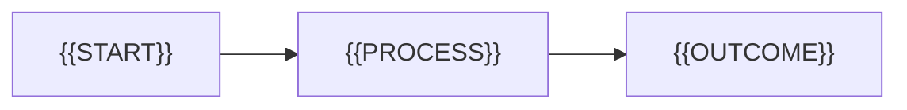

# {{FEATURE_NAME}} — intent

## Problem

{{WHAT_PROBLEM_EXISTS_TODAY}}

## Why it matters

{{USER_OPERATIONAL_BUSINESS_SAFETY_OR_TECHNICAL_IMPACT}}

## Stakeholders

- **{{PERSON_SYSTEM_DEVICE_OR_OPERATOR}}** — {{NEED_OR_RESPONSIBILITY}}

## Desired outcome

{{WHAT_SHOULD_BE_TRUE_WHEN_THE_FEATURE_SUCCEEDS}}

## Primary flow

1. {{TRIGGER_OR_STARTING_STATE}}
2. {{IMPORTANT_INTERACTION_OR_TRANSITION}}
3. {{SUCCESSFUL_OBSERVABLE_RESULT}}

## Alternate and failure flows

- {{IMPORTANT_VARIATION_OR_FAILURE}}

## Non-goals

- {{EXPLICITLY_EXCLUDED_OUTCOME}}

## Flow diagram

Delete this section if a diagram would not improve understanding.

